# 一、HTML

## 	**互联网的三大基石:**

1. **url    统一资源定位符      定位资源**
2. **http   超文本传输协议      传输资源**
3. **html   超文本标记语言      显示资源**

> ​	**HTML的结构:**
>
> ```html
> 		<html>
> 			<head></head>
> 			<body></body>
> 		</html>
> ```
>
> ​		**注意:**
>
> ​			**head中一般存放和页面显示无关的内容**
>
> ​			**body中一般存放页面显示的内容**
>
> ​	**html语言是不区分大小写的语言。**
>
> ​	**html的属性写法,写在标签中  属性名=值    ，值是可以用双引号，也可以用单引号或者不写，注意如果不写后面一定要加一个空格。**

## 1.1.HTML书写规范

```html
<!-- html文件开始, lang="zh_CN"表示中文 -->
<html lang="zh_CN">
  <!-- 头信息 一般分  title标题  css样式 js代码 -->
  <head>
    <!-- 表示当前页面使用UTF-8编码 -->
    <meta charset="UTF-8">
    <title>标题</title>
  </head>
  <body>
    <!-- 页面主体信息 -->
    hello
  </body>
</html>
```

>   <!--  --> 表示注释，注释的内容不会再页面上显示

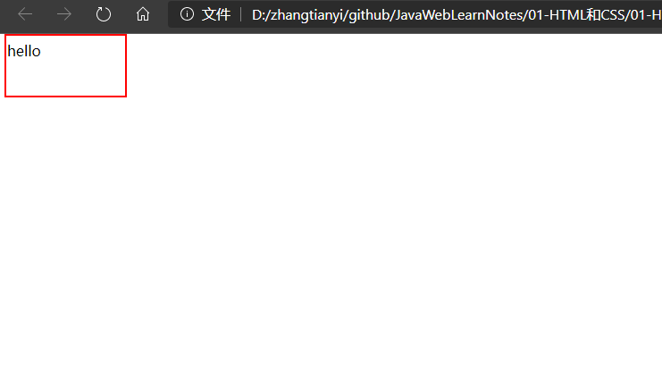

> **head：**

​		**title   页面的标题**

​		**content-type  text/html;charset=编码集    控制页面编码**

​		**refresh  刷新**

​			 **秒数;url=地址     过多少秒之后跳转到指定地址**

​			 **秒数              每隔多少秒刷新一次本页面**

​		**了解:**

​			**expires    页面的有效期     0表示当即失效**

​			**author     作者**

​			**description  描述**

​			**keywords   关键字**

> **body:**

​		**属性:**

​			**bgcolor   背景颜色      可以写单词或者#RGB三原色**

​			**background 背景图片**

## 1.2.HTML标签介绍

### 1.2.1font字体标签

```html
<!DOCTYPE html>
<html lang="en">
<head>
  <meta charset="UTF-8">
  <meta name="viewport" content="width=device-width, initial-scale=1.0">
  <title>font标签</title>
</head>
<body>
  <font color="red" face="宋体" size="7">我是font标签</font>
</body>
</html>
```

| color | 字体颜色 |
| ----- | -------- |
| face  | 字体种类 |
| size  | 字体大小 |

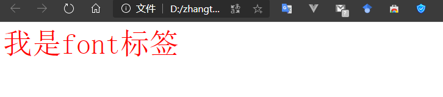

### 1.2.2特殊字符

常用字符

```html
<body>
  特殊字符:&lt;表示左括号
  特殊字符:&gt;表示右括号
  特殊字符:&nbsp;表示空格
</body>
```

### 1.2.3标题标签

标题标签从h1到h6，从大到小

```html
<body>
  <!-- align="left"表示左对齐 center表示居中  right表示右对齐 -->
 <h1 align="left">标题一</h1>
 <h2 align="center">标题二</h2>
 <h3 align="right">标题三</h3>
 <h4 align="left">标题四</h4>
 <h5 align="center">标题五</h5>
 <h6 align="right">标题六</h6>
</body>
```


### 1.2.4超链接标签

```html
<body>
  <!-- 超链接a标签 href是表示地址属性 target 属性  
    _self表示当前页面跳转 _blank表示新页面 -->
  <a href="www.baidu.com" target="_self">百度1</a>
  <a href="www.baidu.com" target="_blank">百度2</a>
</body>
```

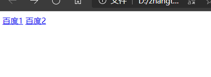

> **锚点:**

1. **声明锚点  ** `<a name="锚点名" />`
2. 使用锚点  `<a href="锚点所在的页面路径#锚点名"></a>`

### 1.2.5 列表

```html
<body>
  <!-- 无序列表 ul li是列表每一项
    type="none" 表示不需要无序列表前面的点  -->
    <font color="red">无序列表</font>
  <ul type="none">
    <li>科比</li>
    <li>乔丹</li>
    <li>奥尼尔</li>
    <li>姚明</li>
  </ul>
  <!-- 有序列表  start  从数字几开始-->
  <font color="red" start="1">有序列表</font>
  <ol>
    <li>科比</li>
    <li>乔丹</li>
    <li>奥尼尔</li>
    <li>姚明</li>
  </ol>
</body>
```

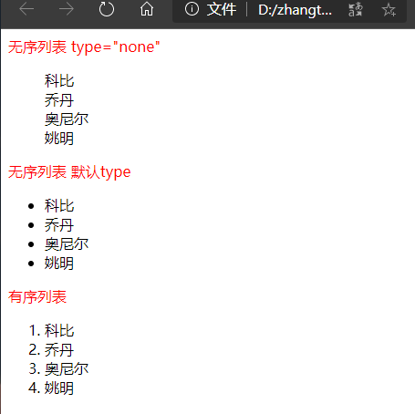

### 1.2.6img图片标签

```html
<body>
  <!-- img标签可以是显示图片 width="200px" height="200px" 分别表示宽度和高度 alt表示图片异常加载提示-->
  <h3 color="red">相对路径的图片，.表示当前目录 src="./images/005.png"</h3>
  
  <h3 color="red">绝对路径的图片</h3>
  <h3 color="red">正确的格式：http://ip:port/工程名/资源路径</h3>
  <h3 color="red">错误的格式：盘符:/目录/文件名</h3>
  
</body>
```

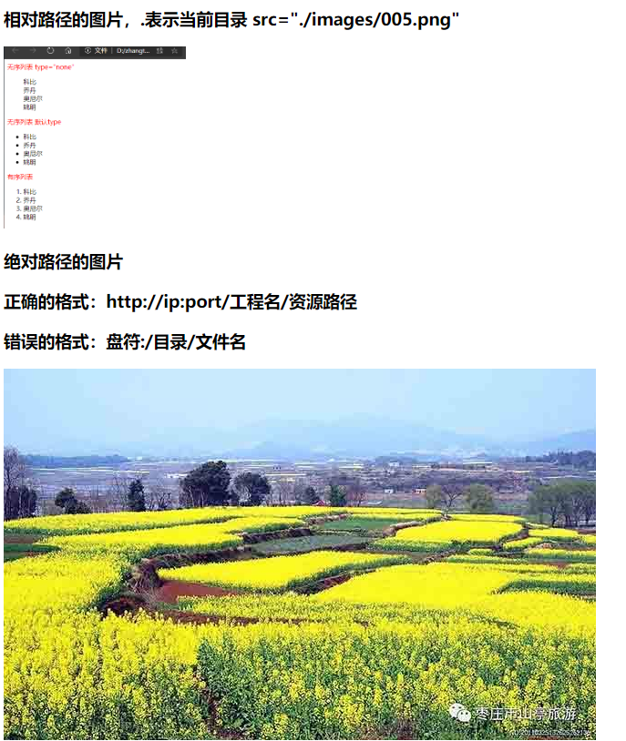

1.2.7 表格标签

```html
<body>
  <!-- 表格标签 border表示边框 align设置在table里面表示表格整个位置
  设置在tr里面表示单元格对齐方式
  单元格间距 cellspacing="10"-->
  <table border="1" width="300" height="300" align="center" cellspacing="0">
    <thead> <!--  thhead表示表头 -->
      <th>第1列</th>
      <th>第2列</th><!--  th是字体加粗的td标签一般用在表头 -->
      <th>第3列</th>
    </thead>
    <tr><!-- 行 -->
      <td align="left">1-1</td><!-- 列，单元格 -->
      <td align="center">1-2</td>
      <td align="right">1-3</td>
    </tr>
    <tr><!-- 行 -->
      <td><b>2-1</b></td><!-- 列，单元格 b标签加粗 -->
      <td>2-2</td>
      <td>2-3</td>
    </tr>
    <tr><!-- 行 -->
      <td>3-1</td><!-- 列，单元格 -->
      <td>3-2</td>
      <td>3-3</td>
    </tr>
  </table>
</body>
```

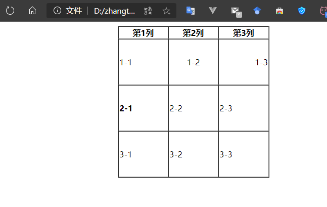

> 表格跨行跨列

```html
<body>
  <!-- colspan表示跨列 rowspan表示跨行-->
  <table border="1" width="300" height="300" align="center" cellspacing="0">
    <thead> <!--  thhead表示表头 -->
      <th>第1列</th>
      <th>第2列</th><!--  th是字体加粗的td标签一般用在表头 -->
      <th>第3列</th>
    </thead>
    <tr><!-- 行 -->
      <td colspan="2">1-1</td><!-- 第一行的第一列跨2列 -->
      <td>1-3</td>
    </tr>
    <tr><!-- 行 -->
      <td rowspan="2">2-1</td><!-- 第二行的第一列跨2行 -->
      <td colspan="2" rowspan="2">2-2</td><!-- 第二行的第二列跨2行2列 -->
    </tr>
    <tr><!-- 行 -->

    </tr>
  </table>
</body>
```

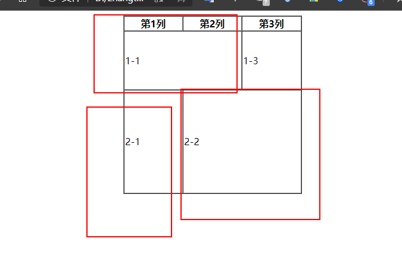

### 1.2.8了解iframe标签

iframe标签可以在html页面上打开一个小窗口在载入一个html页面

```html
<body>
  <p>这是一个单独的页面</p>
  <h2>iframe载入表格跨行跨列的html页面</h2>
  <!-- iframe和a标签中使用那么属性定义一个名称
       a标签中的target协商iframe的name -->
  <iframe src="./09-表格跨行跨列.html" frameborder="0" name="a123" width="400" height="300"></iframe>
  <ul>
    <li><a href="./08-表格标签.html" target="a123">08-表格标签.html</a></li>
  </ul>
</body>
```

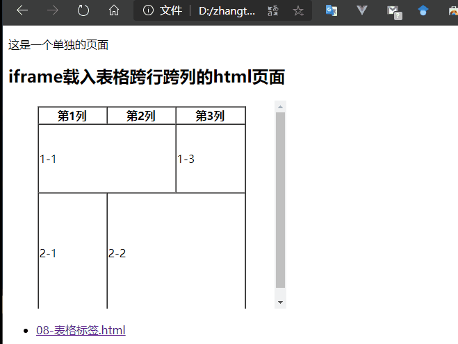

### 1.2.9表单标签

表单是信息集合，例如登录qq的界面有用户名和密码，还有记住密码，和登录按钮这就是一个表单。

```html
<body>

<!-- form标签就是表单
 input type=text 是文本输入框 value 表示默认显示内容
 input type=password 是密码输入框 value 表示默认显示内容 password类型显示······
 input type=radio 是单选框 name 表示单选框的组同名的是一组 一组只能选一个，checked表示默认选中
 input type=checkbox 是多选框 name 表示多选框的组同名的是一组 一组可以选多个，checked表示默认选中
 select 是选择框下拉框 name 表示名字 option是下拉选项 selected表示默认选中 value表示选中后的值 不写取option中间的值
  textarea 表示文本域 多行文本框 rows表示行 cols表示列
 input type=reset 重置按钮 value表示修改按钮上的文本
 input type=submit 提交按钮 value表示修改按钮上的文本
 input type=button 提交按钮 value表示修改按钮上的文本
 input type=file 文件上传按钮 value表示修改按钮上的文本
 input type=hidden 隐藏域 不显示的组件，不需要用户参与的
-->
<form action="">
  <h1 align="center"> 用户注册</h1>
  <table cellspacing="0" align="center">
    <tr>
      <td>用户名：</td>
      <td>
        <input type="text" value="默认值"/><br>
      </td>
    </tr>
    <tr>
      <td>密码：</td>
      <td>
        <input type="password" value="密码"/><br>
      </td>
    </tr>
    <tr>
      <td>确认密码：</td>
      <td>
        <input type="password" value="密码"/><br>
      </td>
    </tr>
    <tr>
      <td>性别：</td>
      <td>
        <input type="radio" name="sex" checked="checked">男<input type="radio" name="sex">女<br>
      </td>
    </tr>
    <tr>
      <td> 兴趣爱好：</td>
      <td>
        <input type="checkbox" name="hobby" checked="checked">java
        <input type="checkbox" name="hobby"checked="checked">python
        <input type="checkbox" name="hobby">c++<br>
      </td>
    </tr>
    <tr>
      <td> 国籍：</td>
      <td>
        <select name="nation">
          <option>--请选择国籍--</option>
          <option value="1" selected="selected">中国</option>
          <option value="2">美国</option>
          <option value="3">英国</option>
        </select><br>
      </td>
    </tr>
    <tr>
      <td>  自我评价：</td>
      <td>
        <textarea cols="30" rows="10">这里写默认值 没有value属性</textarea><br>
      </td>
    </tr>
    <tr>
      <td> <input type="reset" value="重置"><input type="submit" value="提交"></td>
      <td><input type="button" value="普通按钮"><input type="file" value="提交文件"></td>
    </tr>
  </table>
  <input type="hidden" name="1111" value="隐藏域"><br>

</form>
</body>
```

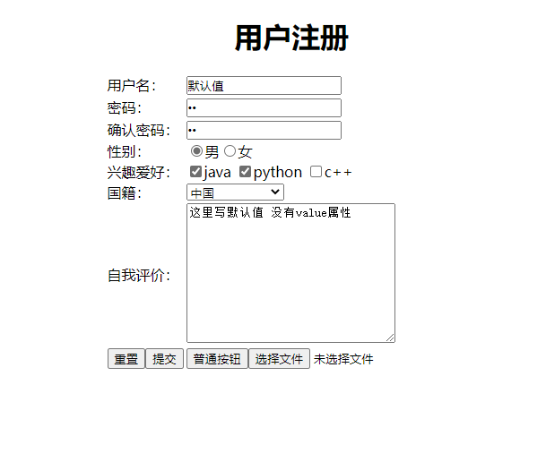

### 1.2.10表单提交

```html
<form action="http://localhost:8080" method="GET">
```

action：访问服务器的地址

method：请求方式有GET和POST

> http://localhost:8080/?username=user&password=123&password2=123&sex=1&hobby=java&hobby=python&nation=1&desc=desc&1111=abc

1. 表单项数据要发送给服务器需要给表单项属性加上name属性
2. 表单项属性要发送指定数据给服务器，例如单选框选中男就发送1过去就需要给每个表单项设置value值
3. 表单项不在提交的form标签中，也不会提交

> 表单请求方法有get和post

**GET方式**

1. **传递参数的地方	地址?参数   地址?键=值&键=值(name=value)**
2. **不安全**
3. **参数长度有限**

**POST方式**

1. **传递参数的地方	请求的请求实体中**
2. **相对安全**
3. **参数长度理论无限制**  

> **一般带有上传文件/密码的表单使用post传递**

### 1.2.11其他html标签

```html
<body>
  <!-- div标签 默认独占一行
       span标签  他的长度是封装数据的长度
      p段落标签默认一行 -->
  <div>div标签1</div>
  <div>div标签2</div>
  <span>span标签1</span>
  <span>span标签2</span>
  <p>p段落标签1</p>
  <p>p段落标签2</p>
</body>
```

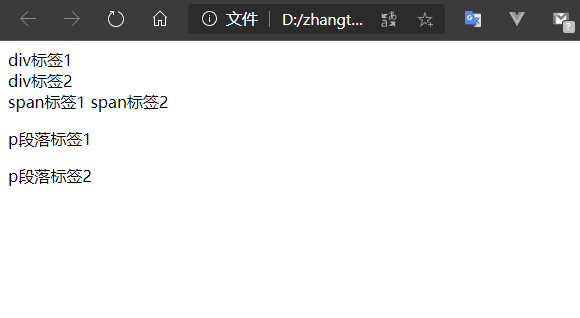

# 二、CSS

## 2.1CSS介绍

css是页面的样式，决定一个网页的漂亮程度。

## 2.2CSS的语法

```css
div {
      font-size: 100px;
      color: red;
    }
```

> 选择器：浏览器根据选择器决定哪些html元素受css样式的影响
>
> 属性：是你要改变的样式名，并且每个属性都有一个值。属性和值呗冒号分开，并由花括号包围，这样组成了一个完整的样式声明
>
> 注意：每个属性用；分开。

## 2.3CSS和HTML结合

```html
<!DOCTYPE html>
<html lang="en">
<head>
  <meta charset="UTF-8">
  <meta name="viewport" content="width=device-width, initial-scale=1.0">
  <title>Document</title>
  <!-- 方式二 -->
  <style>
    div {
      border: 2px solid green;
      font-size: 100px;
      color: green;
    }
  </style>
  <!-- 方式三 -->
  <link rel="stylesheet" href="./14-CSS和HTML结合.css">
</head>
<body>
  <!-- 方式一 -->
  <div style="border: 1px solid red; color: red;font-size: 10px;">第一种方式在标签的style属性上设置key:value;的方式修改样式</div>
  <div>第二种方式在head标签中style标签，使用标准的选择器样式定义样式</div>
  <div>第三中方式在head标签引入外部css样式文件</div>
</body>
</html>
```

> 三种方式的优先级

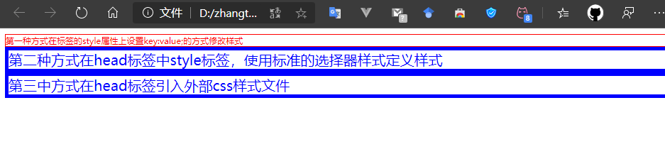

> 由此可见优先级方式1 &gt; 方式3 > 方式2

## 2.4CSS选择器

### 2.4.1标签选择器（元素选择器）

**元素选择器: 选择器{属性名:属性值;属性名2:属性值2;...}**

```css
div {
  border: 1px solid blue;
  font-size: 10px;
  color: blue;
}
```

### 2.4.2 id选择器

**id选择器: 任何标签都可以添加id属性，并且一个页面的id应该保持唯一性**

**\#id{属性名:属性值;属性名2:属性值2;...}**

```css
#abc {
  border: 5px solid red;
  font-size: 20px;
  color: red;
}
```

### 2.4.3类选择器

**类选择器: 任何标签都可以添加class属性，并且class属性是可以相同的**

   **.class值{键1:值1;键2:值2.......}**

```css
.aaa {
  border: 10px solid green;
  font-size: 30px;
  color: green;
}
```

### 2.4.4包含选择器（组合选择器）

包含选择器:

   祖先选择器 子选择器{键1:值1;键2:值2.......}

```css
#abc .ccc {
  border: 10px solid yellow;
  font-size: 30px;
  color: yellow;
}
```

> HTML代码

```html
<!DOCTYPE html>
<html lang="en">
<head>
  <meta charset="UTF-8">
  <meta name="viewport" content="width=device-width, initial-scale=1.0">
  <title>Document</title>

  <!-- 方式三 -->
  <link rel="stylesheet" href="./15-CSS选择器.css">
</head>
<body>
  <div>元素选择器</div>
  <div id="abc">id选择器
    <div class="ccc">包含选择器</div>
  </div>
  <div class="aaa">l类选择器</div>
</body>
</html>
```

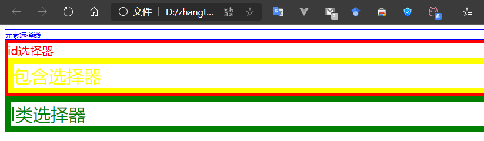

## 2.5常用样式

```html
<head>
  <meta charset="UTF-8">
  <meta name="viewport" content="width=device-width, initial-scale=1.0">
  <title>Document</title>

  <style type="text/css">
    div{
      color: red;
      border: 1px solid blue;
      width: 300px;
      height: 300px;
      background-color: green;
      font-size: 30px;
      margin-left: auto;
      margin-right: auto;
      text-align: center;/*文字居中*/
    }
    a {
      text-decoration: none;/*去掉超链接下划线*/
    }
    ul {
      list-style: none;/*列表去除修饰*/
    }
    table {
      border: 1px solid blue;/*设置边框*/
      border-collapse: collapse;/*设置边框合并*/
    }
    td, th {
      border: 1px solid blue;/*设置边框*/
    }
  </style>
</head>
<body>
  <a href="www.baidu.com">百度</a>
  <table>
    <tr>
      <td>1-1</td>
      <td>1-2</td>
    </tr>
  </table>
  <div>常用样式</div>
  <ul>
    <li>12</li>
    <li>12</li>
    <li>12</li>
  </ul>

</body>
```

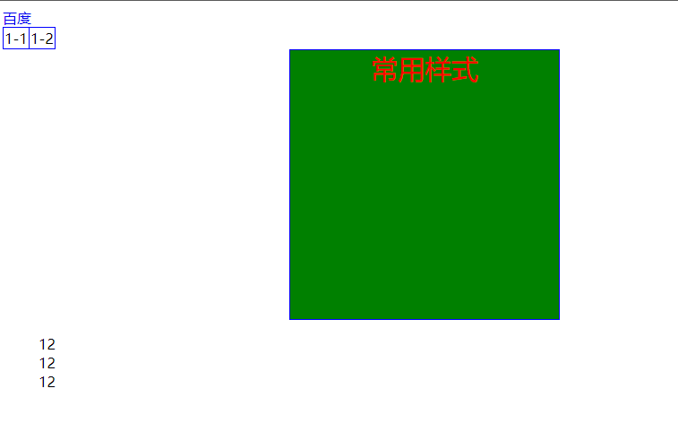