## 1.JavaScript介绍

JavaScript是弱类型脚本语言，平常用来执行页面的脚本，例如点击登录。JavaScript和Java没得关系，完全是因为当时java出名，他蹭热度改名字叫JavaScript。

> JS是弱类型，Java是强类型语言

1. 交互性
2. 安全性
3. 跨平台（只要有浏览器与操作系统无关）

## 2.初入JavaScript

### 2.1.HelloJavaScript

> 方式一（嵌入式）：直接使用script标签

```html
<!DOCTYPE html>
<html lang="en">
<head>
  <meta charset="UTF-8">
  <meta name="viewport" content="width=device-width, initial-scale=1.0">
  <title>Document</title>
  <script type="text/javascript">
    // alert是javascript语言提供的一个警告框函数，可以接受任意类型的参数，将其提示出来
    alert("hello javaScript!")
  </script>
</head>
<body>

</body>
</html>
```

> alert是javascript语言提供的一个警告框函数，可以接受任意类型的参数，将其提示出来

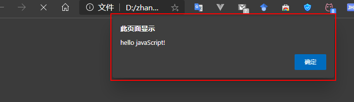

> 方式二：外部引入标签

使用script标签引入单独的JavaScript代码

```html
<script src="./01-HelloJS.js"></script>
```

```javascript
console.log("我是在控制台打印日志的函数，控制台在使用浏览器的时候按F12")
alert("hello 我是外部引入的js文件")
```

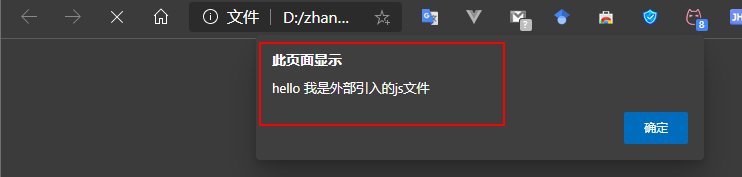

> **常用于测试的两个方法:**
>
> ​		**alert(内容)     弹出警告框，显示内容**
>
> ​		**console.log(内容)   在浏览器的控制台记录内容**
>
> 在浏览器中按F12进入开发者模式的console就是控制台

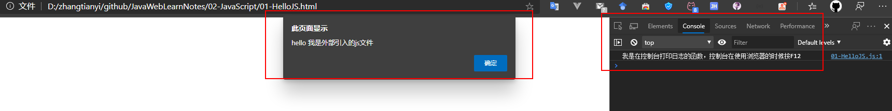

### 2.2.JS变量和数据类型

#### 2.2.1.JS数据的类型:

> 六种

1. undefined
2. null
3. string （字符串）
4. number(整数，小数，NaN（非数字），infinity（正无穷），-infinity（负无穷）)
5. boolean（布尔类型）
6. object（对象）		

> 五种：除去null属于object  

```html
  <script type="text/javascript">
    var i
    console.log(i)//undefined,只声明未初始化的i是undefined
    i = 12 //此时i的类型是number
    console.log(typeof(i))//typeof()是js语言提供的一个行数用来查看数据类型
    i = "abc"
    console.log(typeof(i))//此时i的类型是string
    var a = 12
    var b = "abc"
    console.log(a * b)//打印a * b 的值是NaN 非数字非数值 但是是number类型
    console.log(typeof(a * b))

  </script>
```


> 查看数据类型可以使用typeof()

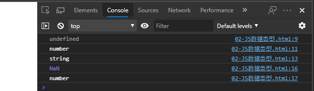

#### 2.2.2.JS的数据类型自动转化

> 转化成字符串String(内容)
>
> 传什么出来什么的字符串格式，类似于java的对象.toString(),变量+"",String.valueOf(内容)

> 转化成布尔Boolean(内容)
>
> 只有六种情况转化成布尔是false，六种:  undefined  null  ""   0   NaN   false

> 转化成数字Number(内容)

1. undefined -->NaN
2. null --> 0
3. "123" --> 123
4. "00123" --> 123
5. 123abc --> NaN
6. true --> 1
7. false -->0

```html
  <script type="text/javascript">
    var a = 12
    String(a)//传什么出来什么的字符串格式，类似于java的对象.toString(),变量+"",String.valueOf(内容)
    console.log(typeof(a))//string
    //转化成布尔
    console.log(Boolean(undefined))//转化undefined 是false
    console.log(Boolean(null))//转化null是false
    console.log(Boolean(""))//转化""是false
    console.log(Boolean(0))//转化数字0是false
    console.log(Boolean(NaN))//转化NaN是false
    console.log(Boolean(false))//转化false是false
    //除了以上6个是false其他都是true
    // 转化成数字
    console.log(Number(undefined))//转化undefined NaN
    console.log(Number(null))//转化null是0
    console.log(Number("123"))//转化"123"是123
    console.log(Number("00123"))//转化"00123"是123
    console.log(Number("123abc"))//转化"123abc"是NaN
    console.log(Number(true))//转化true是1
    console.log(Number(false))//转化false是0

  </script>
```


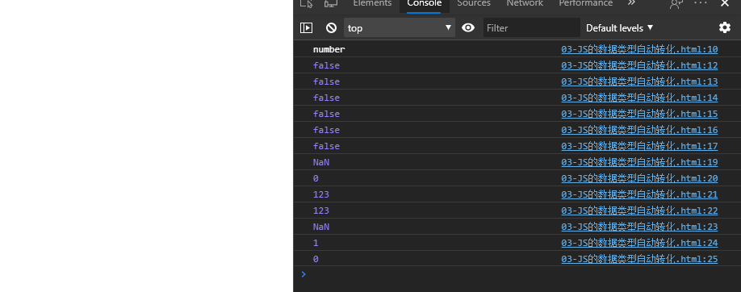

> 补充：类型自动转化

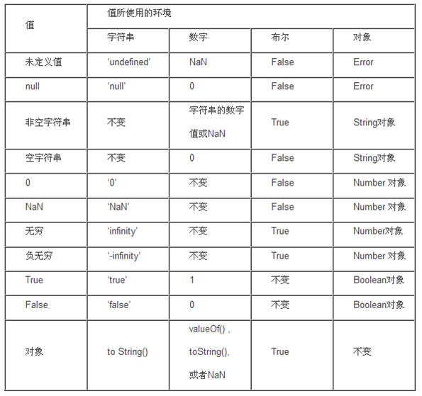

#### 2.2.3.js关系（比较）运算

> ==   等值符,类型相同直接比较值，类型不同转化成相同类型再比较值。

```html
  <script type="text/javascript">
    console.log(12 == "12")//true
    console.log(12 == "13")//false 值不相等
    console.log(12 === "12")//false 等同符类型不相等，值相等也不相等
    console.log(true=="true")//如果是数字，布尔，字符串三者进行比较，转化成数字进行比较，所以是false
    console.log(NaN==NaN)//NaN和所有包括自己都是不相等的
  </script>
```


1. 如果是数字，布尔，字符串三者进行比较，转化成数字进行比较。
2. 如果出现了null或者undefined，则不进行类型的转化，null和undefined除了和自己相等就彼此相等。

> ===  等同符，类型相同比较值，类型不同直接false。

> 注意：
>
> true=="true"//如果是数字，布尔，字符串三者进行比较，转化成数字进行比较，所以是false
>
> NaN==NaN//NaN和所有包括自己都是不相等的**

​	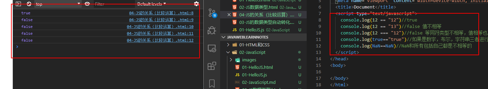

> 补充：**document.write(内容);      往页面输出内容**

#### 2.2.4.逻辑运算

> &&与运算

1. 当表达式全为真。返回最后一个表达式的值
2. 当表达式有一个为真。返回第一个为假的表达式的值

> ||或运算

1. 当表达式全为假时，返回最后个表达式的值
2. 当只有一个表达式为真。就返回第一个为真的表达式的值

> && 和 || 运算有短路，如果第一个表达式已经得到结果。后面的表达式就不在执行了

```html
  <script type="text/javascript">
    //在js语言中，所有的变量都可以作为一个boolean类型的变量去使用
  // undefined  null  ""   0   NaN   false 这六个是false其他都是true
    var a = "abc"
    var b = true
    var c = null
    var d = false
    /*&&与运算
    1. 当表达式全为真。返回最后一个表达式的值
    2. 当表达式有一个为真。返回第一个为假的表达式的值*/
    console.log(a && b)//全为真 true
    console.log(a && d)//第一个表达式为真 false
    console.log(d && a)//第二个表达式为真 false
    console.log(c && d)//全为假 null
    /*||或运算
    1. 当表达式全为假时，返回最后个表达式的值
    2. 当只有一个表达式为真。就返回第一个为真的表达式的值
    */
    console.log(a || b)//全为真 "abc"
    console.log(a || d)//第一个表达式为真 "abc"
    console.log(d || a)//第二个表达式为真 "abc"
    console.log(c || d)//全为假 false
  </script>
```


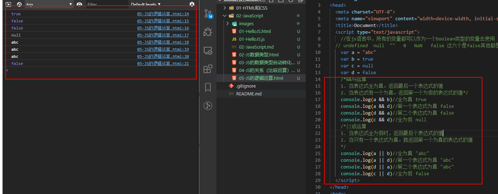


#### 2.2.5.JS的语句

> if-else语句

```js
    var a = true
    //if-else分支语句
    if(a){
      console.log("a为真")
    } else{
      console.log("a为假")
    }
```

> switch语句

```js
    //switch语句，不写break会下穿
    var b = 1;
    switch (b) {
      case 0:
        console.log("b为0")
        break;
      case 1:
        console.log("b为1")
        break;
      default:
      console.log("b为默认值")
        break;
    }
```

> 普通for循环

```js
    //普通for循环
    var c = [0,1,2,3]
    var d = {"key1":"value1", "key2":"value2", "key3":"value3"}
    //数组
    for (let i = 0; i < c.length; i++) {
      console.log(c[i])
    }
```

> 增强for循环

```js
    //增强for循环
    for(var i in c){
      console.log(i)
    }
    for(var i in d){
      console.log(i)
    }
```

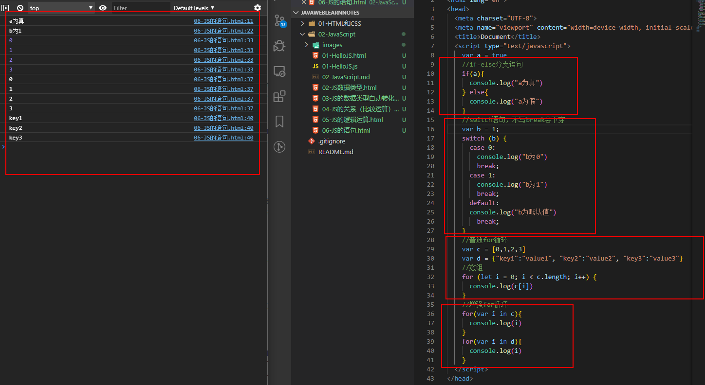

## 3.渐入JavaScript

### 3.1.JS数组

> 第一种

```js
var arr = new Array(ele1,ele2,ele3)
```

> 第二种

```js
var arr = new Array(数组长度)
```

> 第三种

```js
var arr = [ele1, ele2, ele3]
```

```js
    var a = new Array(0, "a", null, true)
    console.log(a.length)//4
    var b = new Array(5)
    console.log(b.length)//5
    var c = [0, "a", null, false]
    console.log(c[3])//第四个元素是false，索引是3

    c.push("123")//push可以添加多个元素 ， 尾部添加
    console.log(c[4])//"123"
    var i =  c.pop()//pop移除最后一个元素并返回
    console.log(i)//"123"
    var d = c.unshift("abc")//往数组的前面添加一个或多个元素，并且返回新数组的长度
    console.log(d)//新数组长度为5
    var e = c.shift()//移除数组的第一个元素并且返回该元素
    console.log(e)//"abc"
    var aa = [0, 1, 2, 3]
    console.log(String(aa))
    aa.splice(1,1,"aaa", "bbb")//在索引为1的地方开始删除1个元素，在删除后加上2个元素
    console.log(String(aa))// aa = [0, "aaa", "bbb", 2, 3]
```

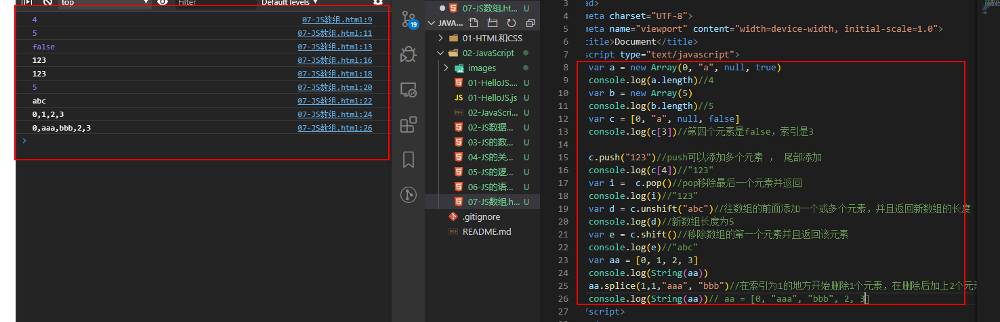

> JS数组特点

1. 可以存放任意类型数据
2. 长度可以任意改变

> 常用api

1. push()  往数组的尾部添加一个或多个元素，并且返回新数组的长度
2. pop()   移除数组的最后一个元素并且返回该元素
3. unshift() 往数组的前面添加一个或多个元素，并且返回新数组的长度
4. shift()  移除数组的第一个元素并且返回该元素
5. splice(start, deleteCount, value...) 插入、删除或替换数组的元素 start 开始插入或者删除的数组元素下标 deletecount表示删除的个数 value要插入的数据，一个或者多个

### 3.2.JS函数

> 第一种定义方式：function 函数名 (形参列表){函数体}

```js
function fun1(p) {
      console.log("第一种方式定义的形参是：" + p)
    }
    fun1("函数1")
```

> 第二种定义方式：var 函数名=function(形参列表){函数体}

```js
    var fun2 = function(p) {
      console.log("第二种方式定义的形参是：" + p)
    }
    fun2("函数2")
```

> 第三种定义方式：var 函数名=new Function(形参列表，函数体);
>
> 注意 参数全部必须用字符串格式。

```js
var fun3 = new Function("p", "console.log('第三种方式定义的形参是：' + p)")
fun3("函数3")
```

> **三种方式的共同点，都可以声明一个函数。**
>
> **三种方式的区别在于加载的时机不同，第一种会具备优先级，第二三种是顺序加载。第一种无论代码在哪写直接就提到最前面加载了，第二种第三种是代码执行到声明时候才会加载**

```js
    //测试重载覆盖和加载顺序
    var testSame = function () {
      console.log("我使用第二种定义函数的方式定义在前面")
    }
    function testSame() {
      console.log("我使用第一种定义函数的方式定义在后面")
    }
    testSame()
```

> 隐形参数 `arguments`

```js
    //隐形参数 arguments
    function testArg() {
      console.log(arguments.length)
      for (let i = 0; i < arguments.length; i++) {
        console.log(arguments[i])
      }
    }
    testArg(1, "aa", false)
```

> 特点

1. js的函数没有重载的概念，直接覆盖上一次的函数定义
2. 写相同的函数名会按照加载的顺序进行覆盖，如果第一种定义方式和第二种第三种混用，第一种第一方式的函数一定会被覆盖掉
3. 形参的个数和实参的个数没有关系

> 补充：匿名自调用函数

```js
//匿名自调用函数
    (function (p) {
      console.log("匿名自调用函数:" + p)
     })(1)
```

- 语法：`(function(形参列表){函数体})(实参列表)`		
- 特点：加载完成之后立即会自己调用自己一次，并且只能调用一次
- 作用：可以用来初始化一些参数或者是配置

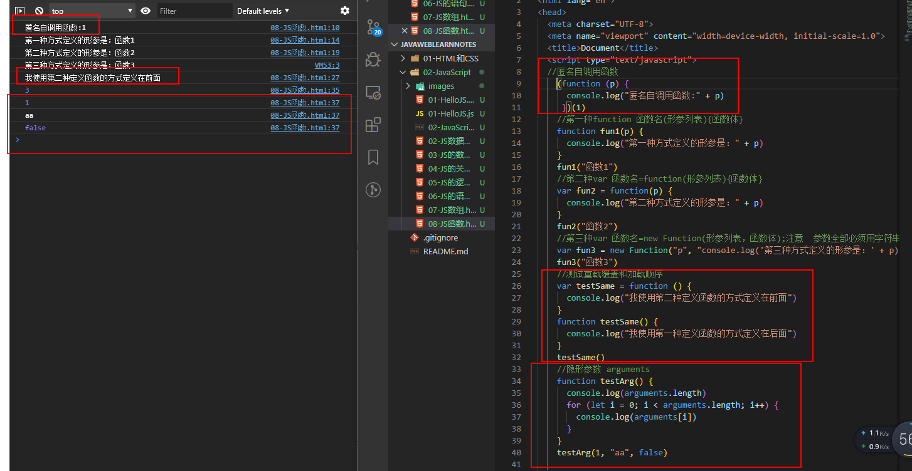

### 3.3.JS对象

> object形式的自定义对象

```js
    //对象的定义
    var obj = new Object() //对象实例(空对象)
    obj.name = "张三" //给对象定义一个name的属性并赋值为"张三"
    obj.fun = function () {
      console.log("obj的姓名是：" + this.name)
    }
    //调用
    obj.fun()
```

> ​	**对象的特性:**

1. **动态的添加属性:对象.属性名=值**
2. **动态的添加函数:对象.函数名=function(){}**	
3. **动态的删除属性或者函数**
   - **delete 对象.函数名**
   - **delete 对象.属性名**

> json对象形式定义对象

```js
    // {}形式定义对象
    var person = {name: "李四"}
    person.age = 18
    person.fun = function () {
      console.log("person的姓名是：" + this.name)
      console.log("person的年龄是：" + this.age)
    }
    person.fun()
```


> json对象取值：

1. **通过.的方式取值       json对象.x     找json的x键所对应的值**
2. **通过中括号的方式取值  json对象[x]   注意中括号中如果没有加引号，则x代表变量，如果带上引号则代表的是键**

```js
    console.log(person.name)//通过.的方式取值
    console.log(person["age"])//**通过中括号的方式取值
```

> 添加删除值：

```js
    // 添加值:
    person.sex = "男"
    person['address'] = "成都"
		// 删除值:
    delete person.sex
    delete person['age']
```

1. **json对象.属性名=值**
2. **json对象[属性名]=值**
3. **delete json对象.属性名**
4. **delete json对象[属性名]**

> 遍历json都对象：

​		**for(var 变量名 in json对象){}**

​				**变量名代表键**

​				**json对象[变量名]  代表值**

```js
    for(var i in person){
      console.log("key:" + i + ", value:" + person[i])
    }
```


> **对象机制**：

**Object是js对象的祖先，所有定义在Object里面的方式、属性、特点其他对象都可以使用。**

> **prototype原型**

**可以给已经写好的模板添加自定义的属性或者是函数。**

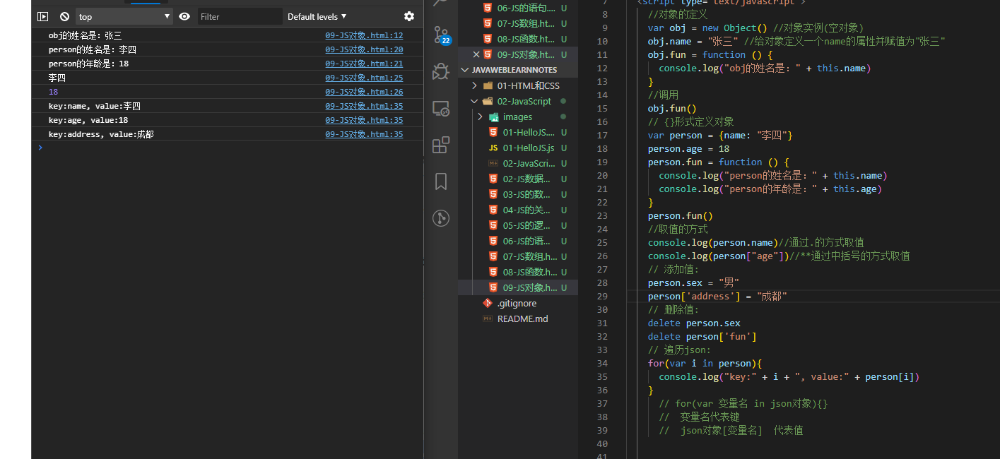

### 3.4.JS的内置函数和对话框

> **eval(字符串形式的js代码)：** 作用以js的方式解析字符串，可以简单的理解成去掉字符串的首尾引号。  常见用法:  eval("var 变量名="+字符串格式的js对象);

```js

```

> **parseInt(字符串) ：**            作用将传入的字符串转化成整数，特殊用法:   parseInt("100abc")-->100   可以用来操作像素px。

```js
    //eval(字符串形式的js代码)：
    eval("var a = {name: 'zzz', age: 18}")
    console.log("a的姓名：" + a.name + "a的年龄：" + a.age)
    //parseInt(字符串) parseInt("100px")-->100 可以用来操作像素px
    console.log(parseInt("123"))
    console.log(parseInt("123px"))
```

> **parseFloat(字符串)**

```js
    //parseFloat(字符串)
    console.log(parseFloat("10.2"))
```

> **isNaN() ：**     判断是否是NaN

```js
    //isNaN
    console.log("123是NaN:" + isNaN("123"))//false
    console.log("123abc是NaN:" + isNaN("123abc"))//true
```

> **isFinite ()：**  判断是否有限

```js
    //isFinite
    console.log(isFinite("123"))//true
    var c = 1/0;
    console.log(isFinite(c))//false
```

**对话框**

> **alert(内容)     警告框，弹出警告框显示内容**

```js
alert("这是警告框")
```

> **prompt(内容)    询问框，弹出询问框点击确定返回用户输入的内容，点击取消返回null**

```js
prompt("这是询问框")
```

> **confirm(内容)   确认框，弹出确认框显示内容，点击确定返回true,点击取消返回false**

```js
//confirm(内容)
confirm("这是内容框")
```

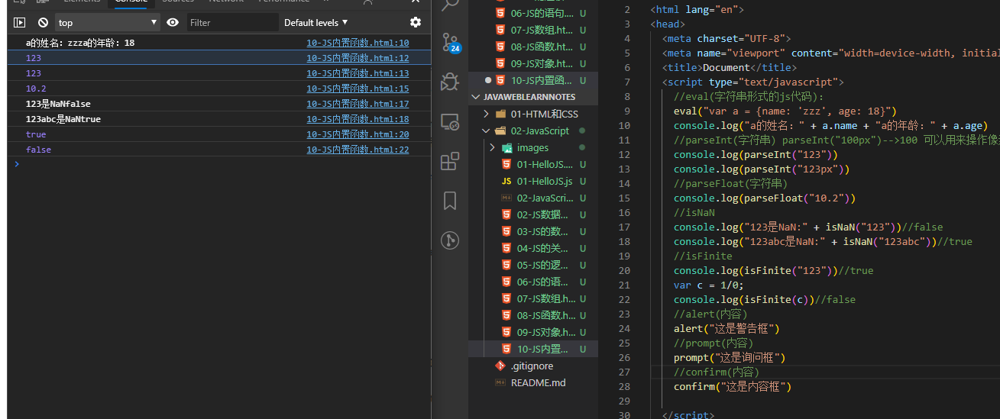

## 4.JavaScript的事件

事件就是用来与页面进行交互的，例如点击登录按钮进行登录就有点击事件。

### 4.1.常用事件

```
onload    页面加载完成
onclick   单击事件
ondblclick 双击事件
onfocus   成为焦点
onblur    失去焦点
onchange  改变值并且失去焦点
onkeydown 键盘按键
onmousemove 鼠标移动
onmouseover 鼠标移入
onmouseout  鼠标移出
onsubmit    表单提交的时候触发
onmousedown 鼠标按键
```

### 4.2.事件的注册（绑定）

就是当事件响应后要执行那些代码，叫做事件的注册或绑定。

> 静态绑定事件

通过html的标签的事件属性字节赋予事件响应后的代码，这种叫静态绑定。例如onload

> 动态绑定事件

先通过js代码得到标签的dom对象，然后在通过`dom对象.事件名 = function(){}`这种形式赋予事件响应后的代码，叫动态注册。动态注册基本步骤：

1. 获取标签对象
2. 标签对象.事件名 = function(){}

### 4.3.onload事件

```html
<!DOCTYPE html>
<html lang="en">
<head>
  <meta charset="UTF-8">
  <meta name="viewport" content="width=device-width, initial-scale=1.0">
  <title>Document</title>
  <script type="text/javascript">
    //onload事件调用的方法
    function onloadfun(a, b) {
      let c = a + b
      alert('静态注册onload事件,a+b='+ c)
    }
  </script>
</head>
<!-- 静态注册onload事件
    onload事件是浏览器解析完页面之后就会自动触发的事件 -->
<body onload="onloadfun(1,2)">
</body>
</html>
```

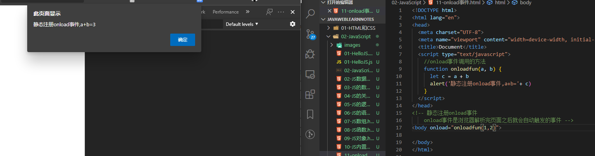

### 4.4.onclick点击事件

```html
<!DOCTYPE html>
<html lang="en">
<head>
  <meta charset="UTF-8">
  <script type="text/javascript">
    //onload事件调用的方法
    function fun1(a, b) {
      let c = a + b
      alert('静态注册onclick事件,a+b='+ c)
    }
    //动态注册onclick事件
    window.onload = function (a, b) {
      //1.获取标签对象,document是js提供的一个文档对象
      var btn2 = document.getElementById("btn2")
      //2.通过标签对象.事件名 = function(){}
      btn2.onclick = function () {
        alert('动态注册onclick事件,a+b='+ 123)
      }
    }
  </script>
</head>
<body>
  <!-- 静态注册 -->
  <button onclick="fun1(1, 2)">静态注册按钮</button>
  <button id="btn2">动态注册按钮</button>
</body>
</html>
```

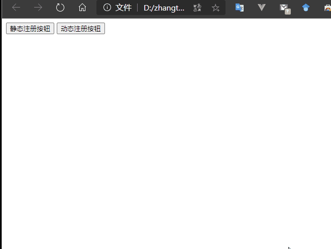

### 4.5.onblur失去焦点

输入框由选中状态变成未选中状态。

```html
<!DOCTYPE html>
<html lang="en">
<head>
  <meta charset="UTF-8">
  <script type="text/javascript">
    //onblur事件调用的方法
    function fun1() {
      alert('静态注册onblur事件')
    }
    //动态注册onblur事件
    window.onload = function (a, b) {
      //1.获取标签对象,document是js提供的一个文档对象
      var input1 = document.getElementById("input1")
      //2.通过标签对象.事件名 = function(){}
      input1.onblur = function () {
        alert('动态注册onblur事件')
      }
    }
  </script>
</head>
<body>
  用户名：<input type="text" onblur="fun1()"><br>
  密码：<input type="text" id="input1">
</body>
</html>
```

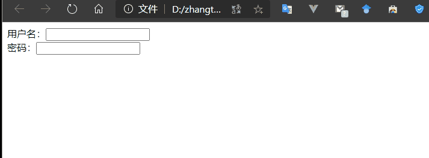

### 4.6.onchange事件改变触发

```html
<!DOCTYPE html>
<html lang="en">
<head>
  <meta charset="UTF-8">
  <script type="text/javascript">
    //onchange事件调用的方法
    function fun1() {
      alert('静态注册onchange事件')
    }
    //动态注册onchange事件
    window.onload = function () {
      //1.获取标签对象,document是js提供的一个文档对象
      var select1 = document.getElementById("select1")
      //2.通过标签对象.事件名 = function(){}
      select1.onchange = function () {
        alert('动态注册onchange事件')
      }
    }
  </script>
</head>
<body>
  请选择省份：
  <!-- 静态注册onchange事件 -->
  <select onchange="fun1()">
    <option value="0">--请选择省份--</option>
    <option value="1">四川</option>
    <option value="2">安徽</option>
    <option value="3">江苏</option>
  </select>
  <br>

  <!-- 动态注册onchange事件 -->
  请选择城市：
  <select id="select1">
    <option value="0">--请选择城市--</option>
    <option value="1">成都</option>
    <option value="2">北京</option>
    <option value="3">上海</option>
  </select>
</body>
</html>
```

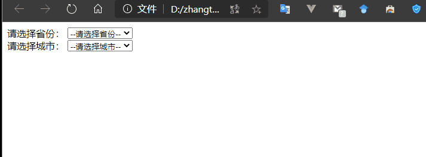

### 4.7.onsubmit事件表单提交

常用于表单提交验证。

```html
<!DOCTYPE html>
<html lang="en">
<head>
  <meta charset="UTF-8">
  <script type="text/javascript">
    //onsubmit事件调用的方法
    function fun1(a) {
      if(a){
        alert('静态注册onsubmit事件')
      }else {
        alert('静态注册onsubmit事件，发现问题')
        return false
      }
    }
    //动态注册onsubmit事件
    window.onload = function () {
      //1.获取标签对象,document是js提供的一个文档对象
      var form1 = document.getElementById("form1")
      //2.通过标签对象.事件名 = function(){}a
      form1.onsubmit = function () {
          alert('动态注册onsubmit事件，发现问题')
          return false
      }
    }
  </script>
</head>
<body>
  <!-- 静态注册 -->
  <form action="http://localhost:8080" method="GET" onsubmit="return fun1(false)">
    <input type="submit" value="静态注册"/>
  </form>
  <!-- 动态注册 -->
  <form action="http://localhost:8080" method="GET" id="form1">
    <input type="submit" value="动态注册"/>
  </form>
</body>
```


## 5.DOM模型

DOM模型全称是Document Object Model 文档对象模型。

就是把html文档的标签、属性、文本都转化成为对象。

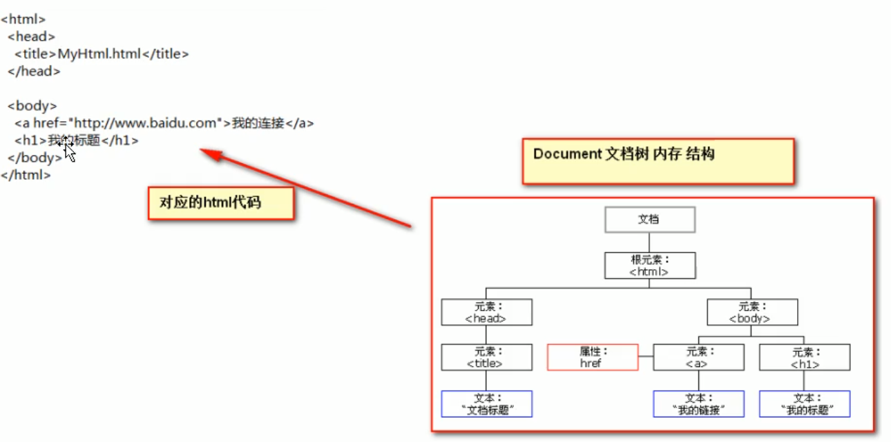

> **理解: window的层级结构，window下面有document,history,location,navigator。**

### 5.1.Document对象

> document对象的理解

1. Document管理了所有的HTML文档内容
2. docment他是一种树结构的文档，层级关系
3. 可以将所有的标签对象化
4. 我们可以通过document访问所有的标签对象

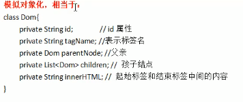

> 常用的方法

1. document.getElementById()根据标签id属性
2. document.getElementsByName() 根据标签name属性
3. document.getElementsByClassName() 根据标签class属性
4. document.getElementsByTagName("button") 根据标签名

```html
<!DOCTYPE html>
<html lang="en">
<head>
  <meta charset="UTF-8">
  <script type="text/javascript">
    function fun1() {
      var input1 = document.getElementById("input1")
      alert("getElementById, input1的值为" + input1.value)
    }
    function fun2() {
      var input2 = document.getElementsByName("input2")
      alert("getElementsByName, input2的值为" + input2[0].value)
    }
    function fun3() {
      var input3 = document.getElementsByClassName("input3")
      alert("getElementsByClassName, input3的值为" + input3[0].value)
    }
    function fun4() {
      var arr = document.getElementsByTagName("button")//获取所有的button
      alert("button个数为" + arr.length)
    }
  </script>
</head>
<body>
  用户名：<input type="text " id="input1" value="input1">
  <button onclick="fun1()">校验getElementById</button>
  <hr>
  用户名：<input type="text " name="input2" value="input2">
  <button onclick="fun2()">校验getElementsByName</button>
  <hr>
  用户名：<input type="text "  class="input3" value="input3">
  <button onclick="fun3()">校验getElementsByClassName</button>
  <hr>
  <button onclick="fun4()">校验getElementsByTagName</button>
</body>
</html>
```

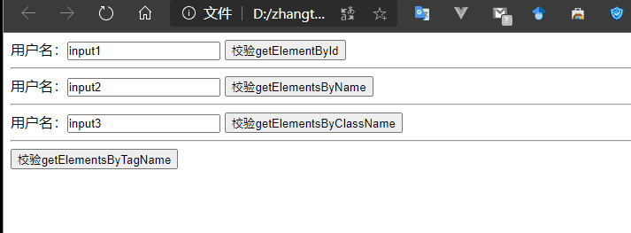

> 注意

1. document对象几个查询方法优先使用document.getElementById()
2. 如果没有id属性，优先使用document.getElementByName()查询或者document.getElementByClassName()
3. 如果id属性和name属性都没有最后按标签名差

### 5.2.节点常用属性和方法

节点就是标签对象，页面上的节点分为三种，元素节点，文本节点，属性节点。

> 直接获取节点方式

1. **document.getElementById(id值)   通过id获取元素节点**、
2. **document.getElementsByTagName(标签名)  通过标签名获取节点**
3. **document.getElementsByName(name值)   通过name获取节点集合，注意低版本ie只认识表单及表单域元素的name,其他元素找的是id**、
4. **document.getElementsByClassName(className) **

> 间接获取方式

1. **父节点.childNodes    获取该父节点下的子节点集合**
2. **父节点.firstChild    获取父节点的第一个子节点**
3. **父节点.lastChild     获取父节点的最后一个子节点**
4. **子节点.parentNode    获取该子节点所在的父节点**
5. **元素节点.nextSibling  获取下一个兄弟节点**
6. **元素节点.previousSibling 获取上一个兄弟节点**

> **注意:除了获取父节点没有浏览器差异性问题，其他获取方式火狐会将文本节点当做节点获取。**

> 节点过滤：
>
> **通过节点.nodeType  获取节点的类型     元素节点1    文本节点3**    

> 操作文档对象模型

1. 创建新的元素节点：**document.createElement(标签名)**
2. 尾部追加新的子节点：**父节点.appendChild(新的子节点)**
3. 插入新的子节点：**父节点.insertBefore(新的，在谁之前)**
4. 替换子节点：**父节点.replaceChild(新的，旧的)**
5. 删除子节点：**父节点.removeChild(子节点)**	

> 注意：**如果追加、替换、插入的是已有的节点，则原来的节点会消失，解决方式可以使用克隆。**

**克隆的语法:**

**元素节点.cloneNode(布尔)**

**true   深度克隆，克隆标签及其中间内容**

**false  浅层克隆，只克隆标签及其属性不克隆标签中间的内容**

### 5.3.window对象

> 设置轮询：
>
> **window.setInterval(函数|字符串,毫秒数);**
>
> ​				**返回该轮询唯一的id**


```js
var id = setInterval(function(){ alert("Hello"); }, 3000)
console.log(id)
```

每三秒弹一次警告框。

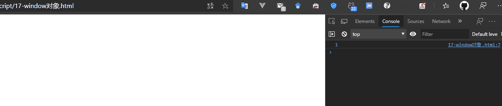


> **清除轮询:**
>
> ​			**window.clearInterval(轮询的id)**

```js
window.clearInterval(1)
```

> **设置延时:**
>
> ​			**window.setTimeout(函数|字符串,毫秒数);**
>
> ​				**返回该延时唯一的id**

```js
var id2 = window.setTimeout(function(){ alert("Hello"); }, 3000)
console.log(id2)
```

3 秒（3000 毫秒）后弹出 "Hello"

> **清除延时:**
>
> ​			**window.clearTimeout(延时的id)**

```js
window.clearTimeout(1)
```

### 5.4.其他对象

> history浏览器二点历史记录(前进后退)
>
> **语法:**
>
> ​			**history.go(整数)**

```js
history.go(-1)后退到上一个页面
history.go(1)前进到下一个页面
```

> **location浏览器的地址栏:**
>
> ​		**语法:**
>
> ​			**window.location=新地址     控制跳转**

```js
window.location = "www.baidu.com"
```

> **navigator获取浏览器的内核信息:**
>
> ​		**语法:**
>
> ​			**navigator.userAgent       可以用来解决浏览器的差异性问题**

```js
navigator.userAgent
```

## 6.补充table对象API

> 属性：

1. **table对象.rows     获取该表格下的行集合**   
2. **tr对象.cells      获取该行下的列集合**
3. **tr对象.rowIndex   获取该行的索引**

> 方法：

1. **table对象.insertRow(索引)    往该表格插入新的一行并且返回插入的这一个行元素，如果不写索引默认是尾部追加**
2. **table对象.deleteRow(索引)    删除该表格的对应索引的行**
3. **tr对象.insertCell(索引)      往该行插入新的一列并且返回插入的这一个列元素，如果不写索引默认是尾部追加**

```html
<!DOCTYPE html>
<html lang="en">
<head>
  <meta charset="UTF-8">
  <script type="text/javascript">
    function fun1() {
      var table =  document.getElementById("table")
      var rows = table.rows
      console.log("table对象的行的集合长度为" + rows.length)
      console.log("table对象的行的集合对象为" + rows)
      console.log("当前行对象索引为" + rows[0].rowIndex)
      var cells = rows[0].cells
      console.log("table对象的行的集合长度为" + cells.length)
      console.log("table对象的列的集合第一个对象的值为" + cells[0].innerHTML)
    }
    function fun2() {
      var table =  document.getElementById("table")
      //插入一行，往该表格插入新的一行并且返回插入的这一个行元素，如果不写索引默认是尾部追加
      var newRow = table.insertRow(0)
      var newCell = newRow.insertCell()//插入一列
      newCell.innerHTML = "新插入的一行一列"
    }
  </script>
</head>
<body>
  <table id="table" border="1" width="300" height="300" align="center" cellspacing="0">
    <thead> <!--  thhead表示表头 -->
      <th>第1列</th>
      <th>第2列</th><!--  th是字体加粗的td标签一般用在表头 -->
      <th>第3列</th>
    </thead>
    <tr>
      <td>1-1</td>
      <td>1-2</td>
      <td>1-3</td>
    </tr>
    <tr>
      <td>2-1</td>
      <td>2-2</td>
      <td>2-3</td>
    </tr>
    <tr>
      <td>3-1</td>
      <td>3-2</td>
      <td>3-3</td>
    </tr>
  </table>
  <hr>
  <button onclick="fun1()">test属性</button>
  <button onclick="fun2()">test方法</button>
</body>
</html>
```

